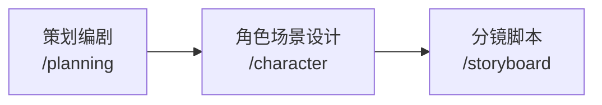
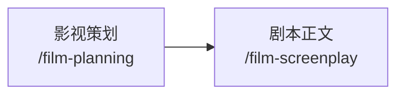

## 基础信息

| 项目 | 说明 |
|------|------|
| Base URL | `http://localhost:8000` |
| 协议 | HTTP/1.1 |
| 响应格式 | `text/event-stream`（SSE） |
| 请求格式 | `application/json` |

---

## SSE 事件协议

所有 Agent 接口均以 **Server-Sent Events（SSE）** 方式流式返回结果。每个事件格式为：

```
data: <JSON 字符串>\n\n
```

### 事件类型

<ResponseField name="chunk" type="object">
  文本增量片段，实时推送，用于实时展示生成过程。

  ```json
  data: {"chunk": "...文本片段..."}
  ```
</ResponseField>

<ResponseField name="done" type="object">
  生成完成事件。除基础字段外，不同接口附带各自的结构化结果字段。

  ```json
  data: {"done": true, "response_id": "resp_0217xxxx", ...}
  ```
</ResponseField>

<ResponseField name="error" type="object">
  出错事件，生成中断。

  ```json
  data: {"error": "错误描述信息"}
  ```
</ResponseField>

---

## 多轮修改

支持 `previous_response_id` 的接口（`/planning`、`/film-planning`、`/film-screenplay`）可进行多轮对话式修改：

1. **首次生成**：正常传入参数，`previous_response_id` 留空
2. **修改**：将上次 `done` 事件中的 `response_id` 作为 `previous_response_id` 传入，同时传入 `feedback` 修改意见

---

## 推荐调用链路



对于短片电影：



---

## 响应头

所有接口响应均包含以下 HTTP 头：

```
Cache-Control: no-cache
X-Accel-Buffering: no
Content-Type: text/event-stream
```
